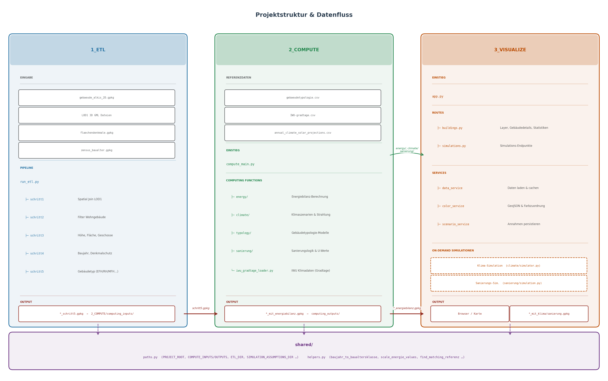

# Digitaler Zwilling – Wärmebedarfsmodellierung

Dieses Tool berechnet den Heizwärmebedarf von Wohngebäuden auf Basis von Geodaten und stellt die Ergebnisse interaktiv im Browser dar. Klimaszenarien und Sanierungsannahmen können direkt in der Oberfläche simuliert werden.

---

## Voraussetzungen

- Python 3.10+
- Abhängigkeiten installieren:

```bash
pip install -r requirements.txt
```

---

## Schnellstart

### 1. Eingabedaten hinterlegen

Die folgenden Dateien müssen vor dem ersten Start in die angegebenen Ordner gelegt werden:


| Datei                               | Zielordner                                                    |
| ----------------------------------- | ------------------------------------------------------------- |
| `ALKIS Sachsen 2D Gebäudepolygone`  | `1_ETL/input/grundkarte_liegenschaftskataster/gpkg_filtered/` |
| 3D Gebäudemodelle Sachsen (`*.gml`) | `1_ETL/input/lod1/`                                           |
| `flaechendenkmale_LE.gpkg`          | `1_ETL/input/flaechendenkmal/`                                |
| `Zensus 2022 Baualtersklassen`      | `1_ETL/input/zensus_baualtersklassen/`                        |


Bis auf die Flächendenkmäler sind die Daten landesweit in Sachsen bzw. bundesweit verfügbar: 
Die ALKIS Polygone können mit einem Preprocessing Skript auf die gewünschten Gemeinden zugeschnitten werden. Dafür muss es in gpkg_raw abgelegt werden und das Skript ausgeführt werden: [https://www.geodaten.sachsen.de/downloadbereich-hausumringe-4174.html](https://www.geodaten.sachsen.de/downloadbereich-hausumringe-4174.html)  
Die 3D Gebäudemodelle können als Batch gedownloaded werden für die notwendigen Gebiete: [https://www.geodaten.sachsen.de/downloadbereich-digitale-3d-stadtmodelle-4875.html](https://www.geodaten.sachsen.de/downloadbereich-digitale-3d-stadtmodelle-4875.html) 
Die Zensus Daten können für ganz Deutschland als CSV heruntergeladen werden und können dann ebenfalls mit einem Preprocessing Skript zugeschnitten und in ein verwendbares .gpkg Format gebracht werden: [https://www.destatis.de/DE/Themen/Gesellschaft-Umwelt/Bevoelkerung/Zensus2022/_inhalt.html](https://www.destatis.de/DE/Themen/Gesellschaft-Umwelt/Bevoelkerung/Zensus2022/_inhalt.html)

### 2. ETL ausführen *(einmalig)*

Verarbeitet die Rohdaten und bereitet sie für die Berechnung vor:

```bash
python 1_ETL/run_etl.py
```

Das Ergebnis wird automatisch nach `2_COMPUTE/computing_inputs/` kopiert.

### 3. Energiebilanz berechnen *(einmalig)*

```bash
python 2_COMPUTE/compute_main.py
```

Das Ergebnis liegt danach in `2_COMPUTE/computing_outputs/`.

### 4. Web-App starten

```bash
python 3_VISUALIZE/app.py
```

Danach die App im Browser öffnen: **[http://127.0.0.1:5001](http://127.0.0.1:5001)**

---

## Funktionen der Web-App

- Karte mit Wärmebedarf, spezifischem Wärmebedarf, Gebäudetyp und Baualtersklasse
- Klima-Simulation: Energiebedarf unter zukünftigen Klimaszenarien (RCP)
- Sanierungs-Simulation: Auswirkungen von Sanierungsmaßnahmen auf den Wärmebedarf

---

## Projektstruktur

